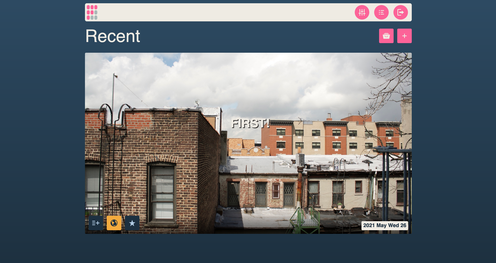

<!--
N.B.: This README was automatically generated by https://github.com/YunoHost/apps/tree/master/tools/README-generator
It shall NOT be edited by hand.
-->

# Fipamo for YunoHost

[](https://dash.yunohost.org/appci/app/fipamo)    
[](https://install-app.yunohost.org/?app=fipamo)

*[Lire ce readme en français.](./README_fr.md)*

> *This package allows you to install Fipamo quickly and simply on a YunoHost server.
If you don't have YunoHost, please consult [the guide](https://yunohost.org/#/install) to learn how to install it.*

## Overview

The Fipamo project was born from a need for a simple, easy to use no data blog platform that doesn’t require much effort to set up and maintain. Fipamo uses Markdown to handle posts and renders them to flat html so you can serve them from anywhere. No complicated set ups. No long list of dependencies. Just write and publish.


**Shipped version:** 2.5.0~ynh1

**Demo:** https://demo.example.com

## Screenshots



## Disclaimers / important information

* Any known limitations, constrains or stuff not working, such as (but not limited to):
    * requiring a full dedicated domain ?
    * architectures not supported ?
    * not-working single-sign on or LDAP integration ?
    * the app requires an important amount of RAM / disk / .. to install or to work properly
    * etc...

* Other infos that people should be aware of, such as:
    * any specific step to perform after installing (such as manually finishing the install, specific admin credentials, ...)
    * how to configure / administrate the application if it ain't obvious
    * upgrade process / specificities / things to be aware of ?
    * security considerations ?

## Documentation and resources

* Official app website: https://fipamo.blog
* Official admin documentation: https://yunohost.org/packaging_apps
* Upstream app code repository: https://code.playvicio.us/Are0h/Fipamo
* YunoHost documentation for this app: https://yunohost.org/app_fipamo
* Report a bug: https://github.com/YunoHost-Apps/fipamo_ynh/issues

## Developer info

Please send your pull request to the [testing branch](https://github.com/YunoHost-Apps/fipamo_ynh/tree/testing).

To try the testing branch, please proceed like that.
```
sudo yunohost app install https://github.com/YunoHost-Apps/fipamo_ynh/tree/testing --debug
or
sudo yunohost app upgrade fipamo -u https://github.com/YunoHost-Apps/fipamo_ynh/tree/testing --debug
```

**More info regarding app packaging:** https://yunohost.org/packaging_apps