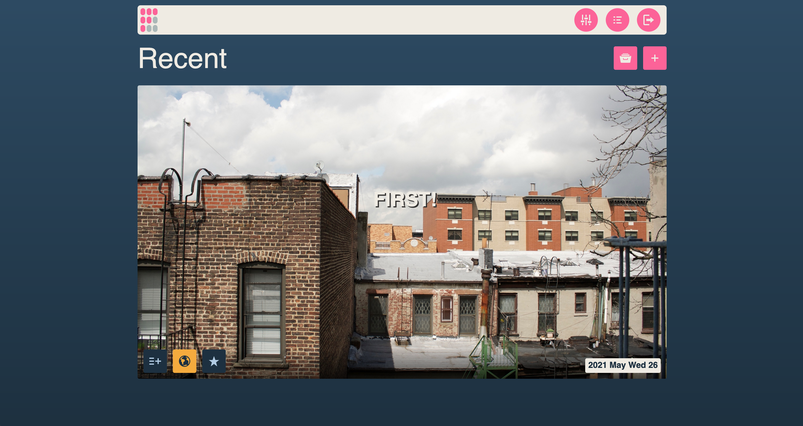

<!--
N.B.: This README was automatically generated by https://github.com/YunoHost/apps/tree/master/tools/README-generator
It shall NOT be edited by hand.
-->

# Fipamo pour YunoHost

[](https://dash.yunohost.org/appci/app/fipamo)    
[](https://install-app.yunohost.org/?app=fipamo)

*[Read this readme in english.](./README.md)*

> *Ce package vous permet d'installer Fipamo rapidement et simplement sur un serveur YunoHost.
Si vous n'avez pas YunoHost, regardez [ici](https://yunohost.org/#/install) pour savoir comment l'installer et en profiter.*

## Vue d'ensemble

The Fipamo project was born from a need for a simple, easy to use no data blog platform that doesn’t require much effort to set up and maintain. Fipamo uses Markdown to handle posts and renders them to flat html so you can serve them from anywhere. No complicated set ups. No long list of dependencies. Just write and publish.


**Version incluse :** 2.5.1~ynh1

**Démo :** https://demo.example.com

## Captures d'écran



## Avertissements / informations importantes

to finish the installation go to `yourdomain.tld/dashboard`
## Documentations et ressources

* Site officiel de l'app : <https://fipamo.blog>
* Documentation officielle de l'admin : <https://yunohost.org/packaging_apps>
* Dépôt de code officiel de l'app : <https://code.playvicio.us/Are0h/Fipamo>
* Documentation YunoHost pour cette app : <https://yunohost.org/app_fipamo>
* Signaler un bug : <https://github.com/YunoHost-Apps/fipamo_ynh/issues>

## Informations pour les développeurs

Merci de faire vos pull request sur la [branche testing](https://github.com/YunoHost-Apps/fipamo_ynh/tree/testing).

Pour essayer la branche testing, procédez comme suit.

``` bash
sudo yunohost app install https://github.com/YunoHost-Apps/fipamo_ynh/tree/testing --debug
ou
sudo yunohost app upgrade fipamo -u https://github.com/YunoHost-Apps/fipamo_ynh/tree/testing --debug
```

**Plus d'infos sur le packaging d'applications :** <https://yunohost.org/packaging_apps>
